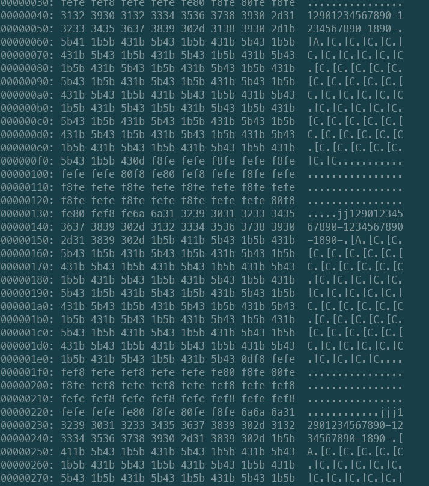
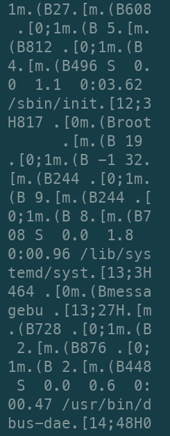
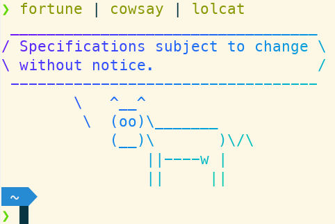
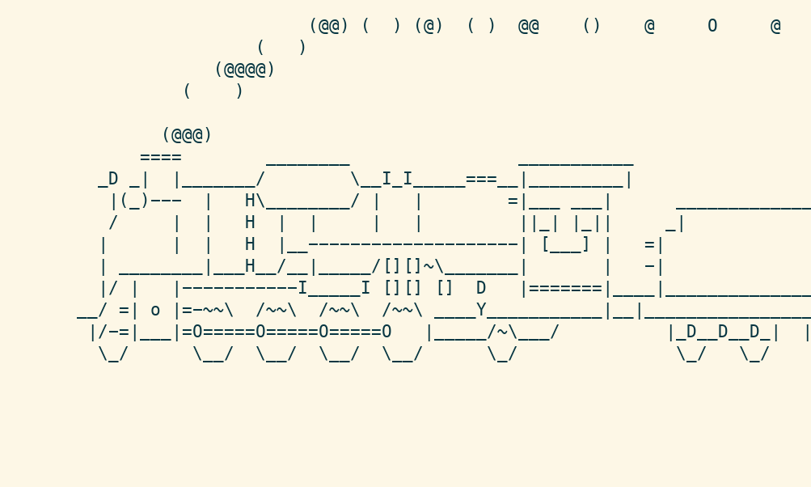
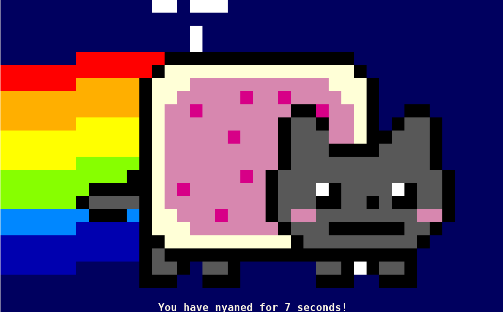
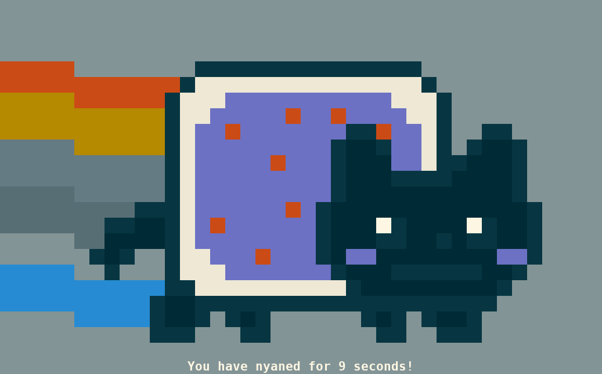
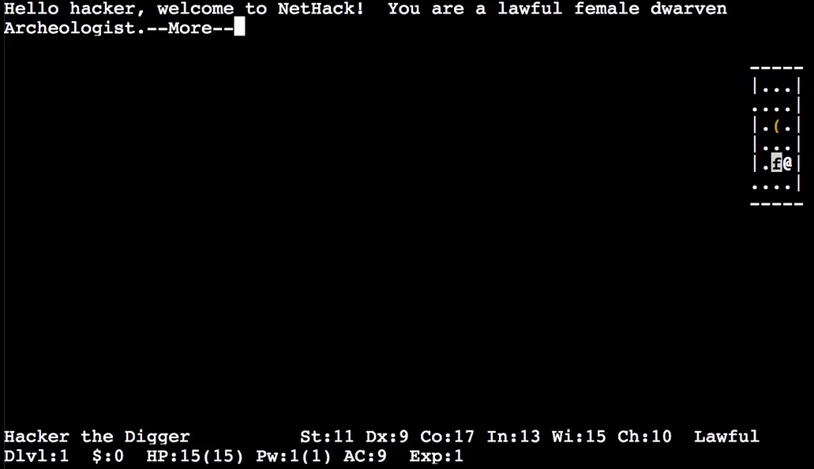

# 透明的文件

题解作者：[Peter Gu](https://github.com/regymm)

出题人、验题人、文案设计等：见 [Hackergame 2021 幕后工作人员](https://hack.lug.ustc.edu.cn/credits/)。

## 题目描述

- 题目分类：general

- 题目分值：150

- 题目链接：[src/transparent.txt](src/transparent.txt)

一个透明的文件，用于在终端中展示一个五颜六色的 flag。

可能是在 cmd.exe 等劣质终端中被长期使用的原因，这个文件失去了一些重要成分，变成了一堆乱码，也不会再显示出 flag 了。

注意：flag 内部的字符全部为小写字母。

## 题解

先说答案吧，类似乱码的东西叫 ANSI escape sequence，或是 VT100 escape codes。

开一个“优质”终端，在所有 [ 前面加上 ESC，并把所有空格替换为会被显示的字符，`cat transparent.txt | sed 's/\[/\x1b[/g' | sed 's/ /#/g'`，结束了。全选可能可以增强显示效果。因为小写字母所以最后一行是 g 不是 9。


这种东西大部分人应该都隐约有印象，因为当用了 VT100 序列的程序被在“劣质”终端，如 cmd.exe（PowerShell 也没好到哪去）中运行，这些序列会被直接打印出来，而不可见字符 ESC（0x1B）则会被显示成乱码或空格。在 Windows 终端或 IDE 中运行一些主要支持 Linux 的程序时这种现象经常发生，比如[这个 Windows Terminal](https://github.com/microsoft/terminal/issues/6634)，[这个 VSCode](https://github.com/microsoft/vscode/issues/31326)。

**那么 VT100 本身为何物呢？**

最早的“终端”是串口连接的电传打字机（Teletypewriter，TTY），只支持非常有限的“光标”移动，比如回车（光标回到开头），换行（光标移动到下一行）等。因为是打字，打出来的字符就不能覆盖了。之后在 1978 年，[VT100 视频终端](https://en.wikipedia.org/wiki/VT100)发布，它使用 Intel 8080 作为处理器，用 CRT 显示 80x24 个字符，支持光标移动 ANSI 转义序列，并获得了很大的成功，ANSI 控制序列也迅速成为了终端的标准（那为什么到今天 cmd.exe 也不支持呢？我也不知道为什么）。

**ANSI 控制序列长什么样？**

其中一部分是 ASCII 值小于 0x1B 的字符，单个出现，比如最常见的回车和换行，CR（0x0D）和 LF（0x0A）。而更多的是 CSI 序列，即以 `ESC [` 开始的控制序列，因为 ESC 通常被显示为 `^[`，这些序列通常以 `^[[` 开头被看到。比如，光标移动：`^[[A, ^[[B, ^[[C, ^[[D`。

在新安装的 Ubuntu 中进入 vi 编辑器的插入模式，按方向键，发现 ABCD 横跳，这个 ABCD 就是从这来的。

另一些常用的比如光标移动 `^[[n;mH`，颜色控制 `^[[38;2;⟨r⟩;⟨g⟩;⟨b⟩m`，都是题目中出现的。然而题目中加了一些混淆，除了输出字符外，光标还会移动到一些随机的位置（要不然一眼就看出来是座标了）。

另一些不那么“标准”但广受支持的序列也是有的，比如光标的显示和隐藏：`^[[?2004h`，`^[[?2004l`。

这些东西都可以直接手写，比如，体验一下颜色：`echo -ne '\x1b[35;48m Hello \x1b[0m \n'`

**题外话**

这些序列的普遍程度可能难以想象，思考这个问题：在终端 shell 中，你可以用方向键把光标移动到字符中间，输入或删除几个字符，普通的行编辑。可能你会想这不过是操作系统的行为，就和在任何一个文本框里的一样。但是，如果你通过 Telnet 连接远程服务器，或者更经典的，用串口连接嵌入式 Linux 设备，你可以干同样的事情。这肯定不是 OS 的行为，因为如果你的 guest 上安装了 zsh 和命令行语法检查，它们仍然可以正常工作，总不可能你的 Xfce Terminal 会做语法检查吧，所以光标和字符的移动肯定是 guest 通过网络甚至速率只有几万 baud 的串口告诉主机的，主机只负责显示。

答案就是这些 VT100 控制序列。Trivial 到移动光标、行编辑这样的事情，都是很多控制序列堆出来的。如下是出题人在嵌入式 Linux 的串口连接中进行行编辑时抓取的序列。在行中间退格，会导致后面所有的字符被清除并重新打印一遍。如果一条指令很长，跨过了多行，光标还需要上下移动。



以下是另一个图片，我忘了当时在干什么了。图中有很多其他种类的控制序列。



当你敲出 `ls`，结果根据文件类型不同显示出不同颜色似乎是想当然的事情，如果你还没意识到，这也是 VT100 序列的结果。于是，可以想象 Vim 和 nano 等编辑器要用多少转义序列了（如果你不理解有一个叫 scroll 的序列是干什么的，可以来问我）。这么一看，还是 ed 好啊，应该趁早学习，否则哪天遇到一个 dumb terminal 就真的只能用 cat 写代码了。

- 建议阅读 2018 年 Hackergame 小 L ~~同学~~大佬的[这篇](https://github.com/ustclug/hackergame2018-writeups/blob/master/official/back_in_time/README.md) write-up。

**那么一个自然的问题是，为什么我天天 `ls | xxx`，重定向和管道里没有混杂进这些字符？**

关于终端我不想说太多（因为不懂，并且很 rabbit hole），但是，程序是可以“知道“自己是否运行在兼容 VT100 的终端里的。通过环境变量 `$TERM` 可以控制终端类型。但是终端类型和”输出是不是 TTY“还是两回事，这个我也不想说太多（比如说，终端似乎只负责解析序列，而程序是通过 OS 设置和得知当前终端的行列数量的）。不过至少知道的是，`ls` 等程序当发现环境不对，就会用最基本的每行一个文件名的形式输出（你可以 `ls | cat` 试一下），而不是那种给人看的格式。也正是因此，我们日常见到 VT100 序列的机会并不多。

- 关于如何让程序以为自己输出到了 TTY 并抓取序列，请阅读 Make a wish 的 write-up

当一些程序中途崩溃，你可能会发现终端的行为变得怪异，或者光标消失。这由两方面因素导致，一个是终端被“滞留”在 Raw mode（默认是 Cooked mode），导致，比如，程序输出的单个的 `\n` 就真的只输出了一个 `\n` 将光标移动到下一行，但没有跟着 `\r` 将光标移动到行首，于是你敲一个 `ls` 人就傻了。这是 TTY 本身的模式控制，和 VT100 不直接相关。而光标消失就是程序还没来得及给出显示光标的序列就挂了的原因。这个时候没必要退出，敲一个 `reset` 就好了。如果想了解更多，你可以稍微阅读一下 [kilo](https://github.com/antirez/kilo) 编辑器的源代码。

知道了这些，你就可以在写自己的程序时玩些花活了，比如让调试信息加亮或红色，~~然后让用 Windows 的小伙伴体验一下~~。

**Non-trivial 的东西**

正如 flag 内容所示，各种字符画和终端动画都和这些序列有些许关系。

简单但很酷的 figlet：

```
$ figlet Hackergame
 _   _            _
| | | | __ _  ___| | _____ _ __ __ _  __ _ _ __ ___   ___
| |_| |/ _` |/ __| |/ / _ \ '__/ _` |/ _` | '_ ` _ \ / _ \
|  _  | (_| | (__|   <  __/ | | (_| | (_| | | | | | |  __/
|_| |_|\__,_|\___|_|\_\___|_|  \__, |\__,_|_| |_| |_|\___|
                               |___/
$ figlet -f script Hackergame
 ,                 _
/|   |            | |
 |___|  __,   __  | |   _   ,_    __,  __,   _  _  _    _
 |   |\/  |  /    |/_) |/  /  |  /  | /  |  / |/ |/ |  |/
 |   |/\_/|_/\___/| \_/|__/   |_/\_/|/\_/|_/  |  |  |_/|__/
                                   /|
                                   \|
```

经典的牛：



Ctrl-C 无法停掉的小火车：



Nyan Cat，你很难相信这也是在终端里。中科大图书馆查询机左下角开始菜单里也有这个“功能”。



如果 `TERM=vt100` 而不是默认的 `xterm`：



命令行中的游戏：


